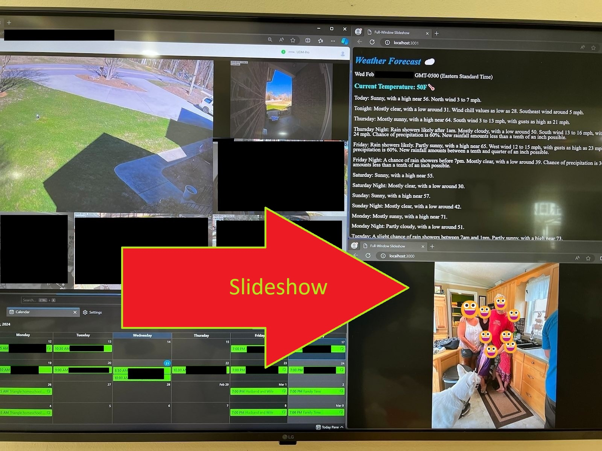

# Monitor Slideshow System
This is a simple project to display pictures on a monitor while rotating and sizing nicely regardless of picture sizing.



## Features

* Runs in a browser window.
  
## Getting Started

**Software:**

* Uses nodejs

**Steps:**

1. Put images under subfolder "images"
2. Start the software using the command ``` npm start ```

## Code

The code is here: [https://github.com/RamboRogers/slideshow]

## License

This project and it's code are all owned by Matthew Roghers, all rights reserved by owner.

## Author

Matthew Rogers

## Contact

matt@rogers.uno
